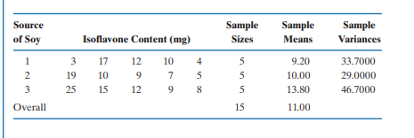
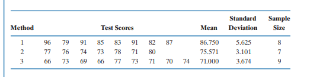

```{r setup, include=FALSE}
knitr::opts_chunk$set(echo = TRUE)
```

# Exercico livro 1

## English 

A large body of evidence shows that soy has health benefits for most people.
Some of these benefits come largely from isoflavones, plant compounds that have
estrogen-like properties. The amount of isoflavones varies widely depending on
the type of food processing. A consumer group purchased various soy products
and ran laboratory tests to determine the amount of isoflavones in each product.
There were three major categories of soy products: cereals and snacks (1), energy
bars (2), and veggie burgers (3). Five different products from each of the three
categories were selected, and the amount of isoflavones (in mg) was determined
for an adult serving of the product. The consumer group wanted to determine if the
average amount of isoflavones was different for the three sources of soy products.
The data are given in Table 8.7. Use these data to test the research hypothesis of
a difference in the mean isoflavone levels for the three categories. Use a 0.05.



The null and alternative hypotheses for this example are

H0: All samples are the same
Ha:  At least one of the three population means is different from the rest

## Português

Um grande conjunto de evidências mostra que a soja traz benefícios à saúde da maioria das pessoas.
Alguns desses benefícios vêm em grande parte das isoflavonas, compostos vegetais que têm
propriedades semelhantes ao estrogênio. A quantidade de isoflavonas varia amplamente dependendo
o tipo de processamento de alimentos. Um grupo de consumidores comprou vários produtos de soja
e realizou testes laboratoriais para determinar a quantidade de isoflavonas em cada produto.
Havia três categorias principais de produtos de soja: cereais e snacks (1), produtos energéticos
barras (2) e hambúrgueres vegetarianos (3). Cinco produtos diferentes de cada um dos três
categorias foram selecionadas e a quantidade de isoflavonas (em mg) foi determinada
para uma porção adulta do produto. O grupo de consumidores queria determinar se o
a quantidade média de isoflavonas foi diferente para as três fontes de produtos de soja.
Os dados são apresentados na Tabela 8.7. Use esses dados para testar a hipótese de pesquisa de
uma diferença nos níveis médios de isoflavonas para as três categorias. Use um 0.05


```{r}
# Criando a base para executar os test 
cereals_and_snacks <- c(3,17,12,10,4)
energy_bars <- c(19,10,9,7,5)
veggie_burgers <- c(25,15,12,9,8)


# Combinar os dados em um data frame
dados <- data.frame(
  Altura = c(cereals_and_snacks, energy_bars, veggie_burgers),
  Semente = factor(rep(c("A", "B", "C"), each = 5))
)

# Realizar o teste ANOVA
resultado_anova <- aov(Altura ~ Semente, data = dados)
summary(resultado_anova)
```

## Df (Graus de liberdade):

### Semente: 2. 

Este valor é o número de grupos (tipos de sementes) menos um. Como há três tipos de sementes, os graus de liberdade são 3 - 1 = 2.

### Residuals: 95. 

Os graus de liberdade residuais são calculados subtraindo o número total de grupos do tamanho total da amostra. Se cada grupo tem 5 observações, então a amostra total é 15. Assim, os graus de liberdade residuais são 15 - 3 = 12.

## Sum Sq (Soma dos Quadrados):

### Semente: 60.4 

Este valor representa a soma dos quadrados entre os grupos. Ele mede a variação total entre as médias dos diferentes tipos de sementes.

### Residuals: 437.6. 

Este valor representa a soma dos quadrados dentro dos grupos, que mede a variação dentro de cada tipo de semente.

## Mean Sq (Média dos Quadrados):

### Semente: 30.20. 

É a soma dos quadrados entre os grupos dividida pelos respectivos graus de liberdade (60.4 / 2).

### Residuals: 36.47. 

É a soma dos quadrados dentro dos grupos dividida pelos respectivos graus de liberdade (36.47/ 12).

### F value (Valor F): 0.828. 

Este é o resultado da divisão da média dos quadrados entre os grupos pela média dos quadrados dentro dos grupos (30.20 / 36.47). O valor F é usado para determinar a significância estatística das diferenças entre as médias dos grupos.

### Pr(>F) (p-valor):

0.46 

Este é o p-valor associado ao teste F. Ele indica a probabilidade de observar um valor F tão extremo quanto (ou mais extremo que) o observado, assumindo que a hipótese nula é verdadeira Neste caso, o p-valor é maior, ficando em um nível de significância convencional de 0.05.

Interpretação:
Como o valor-p é maior que 0.05, você não rejeita a hipótese nula (H0), ou seja, não há diferença significativa nas médias de altura das plantas entre os tipos de sementes

Portanto, não é necessário realizar uma análise post-hoc como o teste de Tukey, já que a ANOVA não indicou uma diferença significativa.

# Exercico 2 

A clinical psychologist wished to compare three methods for reducing hostility
levels in university students and used a certain test (HLT) to measure the degree
of hostility. A high score on the test indicated great hostility. The psychologist used
24 students who obtained high and nearly equal scores in the experiment. Eight
were selected at random from among the 24 problem cases and were treated with
method 1. Seven of the remaining 16 students were selected at random and treated
with method 2. The remaining nine students were treated with method 3. All treatments were continued for a one-semester period. Each student was given the HLT
test at the end of the semester, with the results shown in Table 8.9. Use these
data to perform an analysis of variance to determine whether there are differences
among mean scores for the three methods. Use alfa = .05



## Portugues

Um psicólogo clínico desejava comparar três métodos para reduzir a hostilidade
níveis em estudantes universitários e usou um determinado teste (HLT) para medir o grau
de hostilidade. Uma pontuação alta no teste indicava grande hostilidade. A psicóloga usou
24 alunos que obtiveram pontuações altas e quase iguais no experimento. Oito
foram selecionados aleatoriamente entre os 24 casos problemáticos e foram tratados com
método 1. Sete dos 16 alunos restantes foram selecionados aleatoriamente e tratados
com o método 2. Os nove alunos restantes foram tratados com o método 3. Todos os tratamentos continuaram por um período de um semestre. Cada aluno recebeu o HLT
teste no final do semestre, com resultados apresentados na Tabela 8.9. Use estes
dados para realizar uma análise de variância para determinar se existem diferenças
entre as pontuações médias dos três métodos. Usar alfa = .05

```{r}

student_A <- c(96,79,91,85,83,91,82,87)
student_B <- c(77,76,74,73,78,71,80)
student_C <- c(66,73,69,66,77,73,71,70,74)

# Combinar os dados em um data frame
dados <- data.frame(
  Student = c(student_A, student_B, student_C),
  Method = factor(rep(c("A", "B", "C"), each = 8))
)

# Realizar o teste ANOVA
resultado_anova <- aov(Student ~ Method, data = dados)
summary(resultado_anova)

# Realizar o teste post-hoc de Tukey se necessário
if (summary(resultado_anova)[[1]][["Pr(>F)"]][[1]] < 0.05) {
  tukey_res <- TukeyHSD(resultado_anova)
  print(tukey_res)
}

```
### Interpretação

Os resultados do teste de Tukey mostram que há diferenças significativas nas notas média dos alunos entre várias notas. Apenas a comparação entre os tipos de sementes B e C não mostrou uma diferença estatisticamente significativa (p ajustado maior que 0.05).

A comparação entre os métodos A e B e A e C mostra diferenças significativas, enquanto a comparação entre B e C não apresenta diferença estatisticamente significativa.

## Including Plots

# Exercico 3 

Because many HMOs either do not cover mental health costs or provide only
minimal coverage, ministers and priests often need to provide counseling to persons suffering from mental illness. An interdenominational organization wanted
to determine whether the clerics from different religions have different levels
of awareness with respect to the causes of mental illness. Three random samples were drawn, one containing 10 Methodist ministers, a second containing 10
Catholic priests, and a third containing 10 Pentecostal ministers. Each of the 30
clerics was then examined, using a standard written test, to measure his or her
knowledge about causes of mental illness. The test scores are listed in Table 8.12.
Does there appear to be a significant difference in the mean test scores for the
three religions? 


Ha:  At least one of the three groups of clerics differs from the others
with respect to knowledge about causes of mental illness.

H0:  There is no difference among the three groups with respect to
knowledge about the causes of mental illness (i.e., the samples of
scores were drawn from identical populations). 


```{r}
methodist = c(62,60,60,25,24,23,20,13,12,6)
catholic = c(62,62,24,24,22,20,19,10,8,8)
pentecostal = c(37,31,15,15,14,14,14,5,3,2)

library(ggplot2)

# Carregar os dados
cleric <- c(62,60,60,25,24,23,20,13,12,6,
            22,62,24,24,22,20,19,10,8,8,
            37,31,15,15,14,14,14,5,3,2)
tratamento <- factor(rep(c("Methodist", "Catholic", "Pentecostal"), each = 10))

# Aplicar ANOVA
anova_result <- aov(cleric ~ tratamento)
summary(anova_result)

# Aplicar teste de Kruskal-Wallis
kruskal_result <- kruskal.test(cleric ~ tratamento)
kruskal_result

dataCleric <- data.frame(cleric, tratamento)

# Testando a normalidade para cada grupo
for (nivel in unique(dataCleric$tratamento)) {
  group_cleric <- dataCleric$cleric[dataCleric$tratamento == nivel]
  shapiro_result <- shapiro.test(group_cleric)
  cat("Resultados do teste de Shapiro-Wilk para o grupo", nivel, ":\n")
  print(shapiro_result)
  cat("\n")  # Adiciona espaço entre os resultados para clareza
}

ggplot(dataCleric, aes(sample = cleric)) + 
  facet_wrap(~ tratamento) + 
  stat_qq() + 
  stat_qq_line()

```

Note that the `echo = FALSE` parameter was added to the code chunk to prevent printing of the R code that generated the plot.
